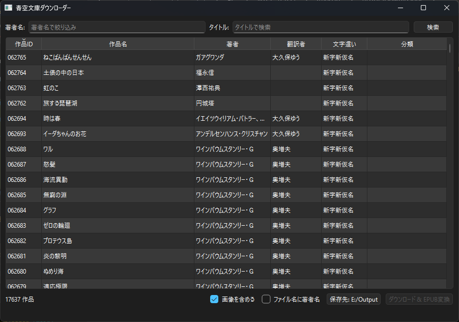

# AosoraDownloader

[青空文庫](https://www.aozora.gr.jp/)の作品をダウンロードし、EPUB 3.0形式に変換するWindows向けGUIアプリケーションです。
高速化、公開日・最終更新日表示、カタログ更新を追加。



## 機能

- **作品検索**: 約17,800作品から著者名・タイトルで絞り込み検索（部分一致、AND条件）
- **EPUB変換**: 青空文庫テキスト形式をEPUB 3.0（縦書き対応）に変換
- **挿絵対応**: zip同梱画像を自動抽出、未同梱の場合はサーバーからダウンロード
- **カバー・タイトルページ**: SVGカバーページとタイトルページを自動生成
- **一括処理**: 複数作品の同時選択・バッチ変換

### 出力オプション

| オプション | 説明 |
|---|---|
| 画像を含める | カバー画像と挿絵をEPUBに含める |
| ファイル名に著者名 | `[著者名] 作品名.epub` 形式で出力 |

## セットアップ

### 実行ファイルから起動

`dist/AosoraDownloader.exe` をそのまま実行できます。CSVデータはexeに同梱されています。

### ソースから起動

```bash
pip install -r requirements.txt
python main.py
```

**必要環境**: Python 3.10以上

### exeビルド

```bash
pip install pyinstaller
pyinstaller --noconfirm AosoraDownloader.spec
```

## コード構成

```
main.py                  エントリーポイント
aozora/
  models.py              Work データクラス
  catalog.py             CSV読み込み・作品ID単位の集約・検索
  downloader.py          テキスト/画像ダウンロード・zip展開
  parser.py              青空文庫テキスト形式 → XHTML変換
  epub_writer.py         EPUB 3.0 ファイル生成
gui/
  main_window.py         メインウィンドウ（QTableView + フィルター + 操作UI）
  workers.py             QThread ワーカー（ダウンロード→変換パイプライン）
list_person_all_extended_utf8.csv
                         青空文庫作品メタデータ（UTF-8 BOM, 約19,450行×55列）
```

### データフロー

```
CSV読み込み (catalog.py)
  → 作品ID単位でWorkに集約（複数著者/翻訳者を統合）
  → QTableViewで一覧表示 (main_window.py)

ユーザーが作品を選択 → ダウンロード&変換ボタン

DownloadConvertWorker (workers.py)
  → download_text(): zip取得、テキスト+同梱画像を展開 (downloader.py)
  → parse_aozora_text(): 青空文庫注記をXHTMLに変換 (parser.py)
  → 不足画像をHTTPでフォールバック取得 (downloader.py)
  → write_epub(): EPUB 3.0ファイル生成 (epub_writer.py)
```

### 対応する青空文庫テキスト注記

| 注記 | 例 | 変換結果 |
|---|---|---|
| ルビ | `漢字《かんじ》` | `<ruby>漢字<rt>かんじ</rt></ruby>` |
| ルビ（範囲指定） | `｜山嵐《やまあらし》` | 同上 |
| 傍点 | `○○［＃「○○」に傍点］` | `<em class="sesame">` |
| 見出し | `○○［＃「○○」は大見出し］` | `<h1>` ～ `<h3>` |
| 字下げ | `［＃３字下げ］` | `margin-left: 3em` |
| 字下げブロック | `［＃ここから３字下げ］...終わり` | `<div>` |
| 改ページ | `［＃改ページ］` | `<hr class="pagebreak"/>` |
| 縦中横 | `29［＃「29」は縦中横］` | `<span class="tcy">` |
| 太字・斜体 | `○○［＃「○○」は太字］` | `<b>` / `<i>` |
| 傍線 | `○○［＃「○○」に傍線］` | `text-decoration: underline` |
| 挿絵 | `［＃説明（file.png、横W×縦H）入る］` | `` |
| 外字 | `※［＃「...」、第3水準...］` | 説明テキスト表示 |
| くの字点 | `／＼` `／″＼` | `〳〵` `〴〵` |
| 地付き | `［＃地付き］` | `text-align: right` |

### EPUB出力仕様

- **EPUB 3.0準拠**: mimetype無圧縮先頭配置、OPFパッケージ文書、XHTMLナビゲーション
- **縦書き**: `writing-mode: vertical-rl`、ページ進行方向RTL
- **構成**: カバーページ（SVG） → タイトルページ → 本文
- **CSS**: ルビサイズ、傍点（sesame dot）、縦中横（text-combine-upright）対応

### CSVデータ構造

`list_person_all_extended_utf8.csv` は青空文庫が公開する作品メタデータです。

- 1作品IDに対して複数行が存在する場合がある（著者・翻訳者・編者等が別レコード）
- `catalog.py` がこれを作品ID単位に集約
- `役割フラグ`: 著者、翻訳者、編者、校訂者、その他
- `テキストファイルURL`: zip形式（ShiftJIS .txt + 画像同梱の場合あり）

## 依存ライブラリ

| ライブラリ | 用途 |
|---|---|
| PySide6 | GUI（Qt for Python） |

EPUB生成・青空文庫テキスト解析はすべて標準ライブラリのみで自前実装しています。

## 修正履歴

### 2026-06/06

## ライセンス

本ソフトウェアが変換する作品データの著作権は各権利者に帰属します。
青空文庫の利用規約に従ってご使用ください。

## Credits

Based on [AosoraDownloader](https://github.com/feeeeeeen/AosoraDownloader) by feeeeeeen.
